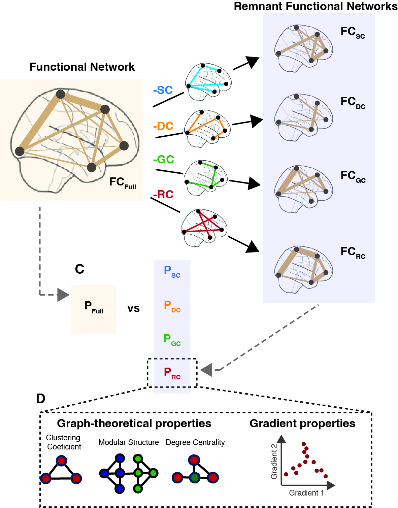

Quantifying the Influence of Biophysical Factors in Shaping Brain Communication Through Remnant Functional

 

This repository contains at the code and data created to the reproduce the main figures in the paper "Quantifying the influence of biophysical factors in shaping brain communication through remnant functional" published in Network Neuroscience.

Analysis_Figures_X: are scripts for running and generating the figures associated with the main text.

Data.m: contained the FC from the HCP dataset, estimated biophysical networks (sc, ec, gc, and rc) and data from the LA5c dataset.

create_RFN.m: is the main function for creating the Remnant Functional Networks (RFN). 

my_delta.m: estimates the percent difference between features estimated from fully connected FC network and RFN.

percent_overlap.m: calculates the percent of connections in FC that have an underlying biophysical connection.

(un)wrapMat.m: (un)vectorized the brain networks.
