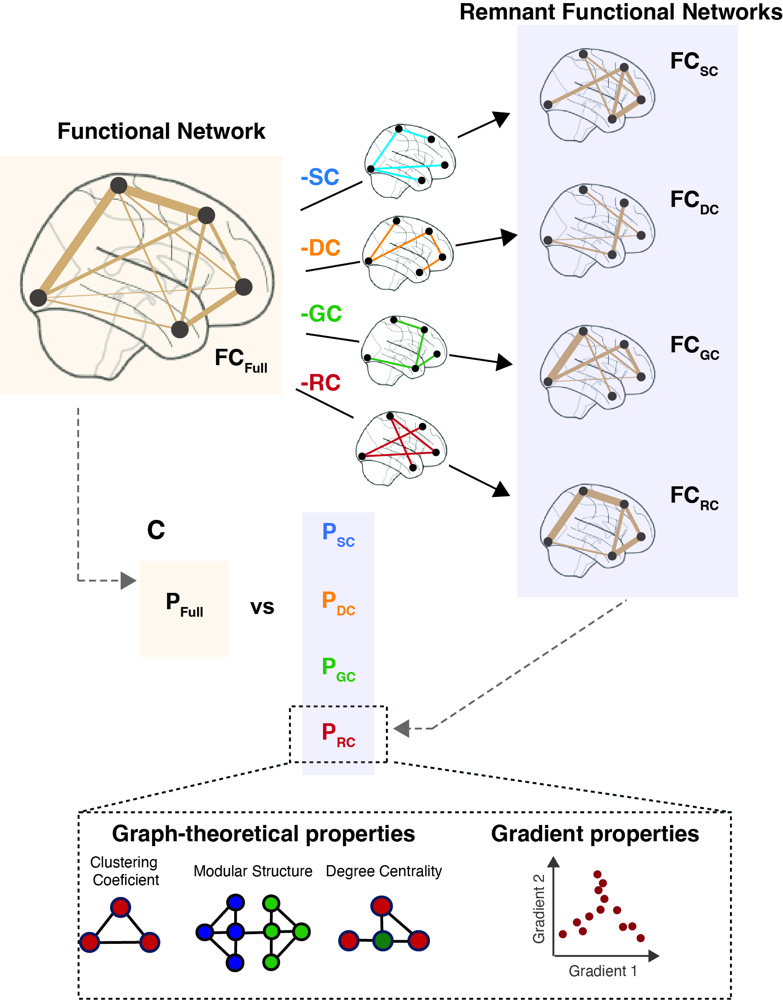

**Quantifying the Influence of Biophysical Factors in Shaping Brain Communication Through Remnant Functional**

  

This repository contains the code used to reproduce the main figures from the paper **"Quantifying the Influence of Biophysical Factors in Shaping Brain Communication Through Remnant Functional Networks"**, published in *Network Neuroscience*.

---

## **Repository Structure**

### **Analysis_Figures_X**
Scripts for running and generating the figures associated with the main text.

### **create_RFN.m**
The primary function for creating Remnant Functional Networks (RFN).

### **my_delta.m**
Function to estimate the percent difference between features derived from the fully connected FC network and RFN.

### **percent_overlap.m**
Calculates the percentage of connections in the FC network that have an underlying biophysical connection.

### **(un)wrapMat.m**
Functions to vectorize or unvectorize brain networks.

